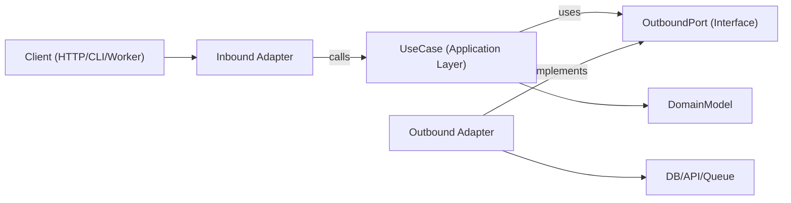

# ヘキサゴナルアーキテクチャ

ヘキサゴナルアーキテクチャ（ポートとアダプター）はビジネスロジックをフレームワーク、トランスポート、および永続化の詳細から独立させます。コアアプリは抽象ポートに依存し、アダプターはエッジでこれらのポートを実装します。

## 使用タイミング

- 長期的な保守性とテスト可能性が重要な新機能を構築するとき。
- ドメインロジックがI/O関心事と混在しているレイヤードまたはフレームワーク重視のコードをリファクタリングするとき。
- 同じユースケースに対して複数のインターフェース（HTTP、CLI、キューワーカー、cronジョブ）をサポートするとき。
- ビジネスルールを書き直さずにインフラ（データベース、外部API、メッセージバス）を置き換えるとき。

境界、ドメイン中心の設計、密結合サービスのリファクタリング、または特定のライブラリからアプリケーションロジックを分離するリクエストが含まれる場合にこのスキルを使用します。

## コアコンセプト

- **ドメインモデル**: ビジネスルールとエンティティ/値オブジェクト。フレームワークのインポートなし。
- **ユースケース（アプリケーション層）**: ドメインの動作とワークフローのステップをオーケストレートする。
- **インバウンドポート**: アプリケーションが何をできるかを記述するコントラクト（コマンド/クエリ/ユースケースインターフェース）。
- **アウトバウンドポート**: アプリケーションが必要とする依存関係のコントラクト（リポジトリ、ゲートウェイ、イベントパブリッシャー、クロック、UUIDなど）。
- **アダプター**: ポートのインフラと配信実装（HTTPコントローラー、DBリポジトリ、キューコンシューマー、SDKラッパー）。
- **コンポジションルート**: 具体的なアダプターがユースケースにバインドされる単一の配線場所。

アウトバウンドポートインターフェースは通常アプリケーション層（または抽象化が真にドメインレベルの場合はドメインのみ）に存在し、インフラアダプターがそれらを実装します。

依存の方向は常に内向き:

- アダプター -> アプリケーション/ドメイン
- アプリケーション -> ポートインターフェース（インバウンド/アウトバウンドコントラクト）
- ドメイン -> ドメイン専用の抽象化（フレームワークやインフラ依存関係なし）
- ドメイン -> 外部への依存なし

## 仕組み

### ステップ1: ユースケース境界をモデル化する

明確な入力と出力DTOを持つ単一のユースケースを定義します。トランスポートの詳細（Expressの `req`、GraphQLの `context`、ジョブペイロードラッパー）をこの境界の外に置きます。

### ステップ2: まずアウトバウンドポートを定義する

すべてのサイドエフェクトをポートとして識別します:

- 永続化（`UserRepositoryPort`）
- 外部呼び出し（`BillingGatewayPort`）
- クロスカッティング（`LoggerPort`、`ClockPort`）

ポートは技術ではなく機能をモデル化すべきです。

### ステップ3: 純粋なオーケストレーションでユースケースを実装する

ユースケースクラス/関数はコンストラクター/引数でポートを受け取ります。アプリケーション層の不変条件を検証し、ドメインルールを調整し、プレーンなデータ構造を返します。

### ステップ4: エッジでアダプターを構築する

- インバウンドアダプターはプロトコル入力をユースケース入力に変換する。
- アウトバウンドアダプターはアプリコントラクトを具体的なAPI/ORM/クエリビルダーにマップする。
- マッピングはアダプターに留まり、ユースケース内には入れない。

### ステップ5: コンポジションルートですべてを配線する

アダプターをインスタンス化し、ユースケースに注入します。この配線を集中化して、隠れたサービスロケーターの動作を避けます。

### ステップ6: 境界ごとにテストする

- フェイクポートでユースケースをユニットテストする。
- 実際のインフラ依存関係でアダプターをインテグレーションテストする。
- インバウンドアダプターを通じてユーザー向けのフローをE2Eテストする。

## アーキテクチャ図



## 推奨モジュールレイアウト

明示的な境界を持つフィーチャーファースト構成を使用します:

```text
src/
  features/
    orders/
      domain/
        Order.ts
        OrderPolicy.ts
      application/
        ports/
          inbound/
            CreateOrder.ts
          outbound/
            OrderRepositoryPort.ts
            PaymentGatewayPort.ts
        use-cases/
          CreateOrderUseCase.ts
      adapters/
        inbound/
          http/
            createOrderRoute.ts
        outbound/
          postgres/
            PostgresOrderRepository.ts
          stripe/
            StripePaymentGateway.ts
      composition/
        ordersContainer.ts
```

## TypeScriptの例

### ポートの定義

```typescript
export interface OrderRepositoryPort {
  save(order: Order): Promise<void>;
  findById(orderId: string): Promise<Order | null>;
}

export interface PaymentGatewayPort {
  authorize(input: { orderId: string; amountCents: number }): Promise<{ authorizationId: string }>;
}
```

### ユースケース

```typescript
type CreateOrderInput = {
  orderId: string;
  amountCents: number;
};

type CreateOrderOutput = {
  orderId: string;
  authorizationId: string;
};

export class CreateOrderUseCase {
  constructor(
    private readonly orderRepository: OrderRepositoryPort,
    private readonly paymentGateway: PaymentGatewayPort
  ) {}

  async execute(input: CreateOrderInput): Promise<CreateOrderOutput> {
    const order = Order.create({ id: input.orderId, amountCents: input.amountCents });

    const auth = await this.paymentGateway.authorize({
      orderId: order.id,
      amountCents: order.amountCents,
    });

    // markAuthorizedは新しいOrderインスタンスを返す。インプレースでのミューテーションは行わない。
    const authorizedOrder = order.markAuthorized(auth.authorizationId);
    await this.orderRepository.save(authorizedOrder);

    return {
      orderId: order.id,
      authorizationId: auth.authorizationId,
    };
  }
}
```

### アウトバウンドアダプター

```typescript
export class PostgresOrderRepository implements OrderRepositoryPort {
  constructor(private readonly db: SqlClient) {}

  async save(order: Order): Promise<void> {
    await this.db.query(
      "insert into orders (id, amount_cents, status, authorization_id) values ($1, $2, $3, $4)",
      [order.id, order.amountCents, order.status, order.authorizationId]
    );
  }

  async findById(orderId: string): Promise<Order | null> {
    const row = await this.db.oneOrNone("select * from orders where id = $1", [orderId]);
    return row ? Order.rehydrate(row) : null;
  }
}
```

### コンポジションルート

```typescript
export const buildCreateOrderUseCase = (deps: { db: SqlClient; stripe: StripeClient }) => {
  const orderRepository = new PostgresOrderRepository(deps.db);
  const paymentGateway = new StripePaymentGateway(deps.stripe);

  return new CreateOrderUseCase(orderRepository, paymentGateway);
};
```

## マルチ言語マッピング

同じ境界ルールをエコシステム全体に適用します。変わるのは構文と配線スタイルのみです。

- **TypeScript/JavaScript**
  - ポート: インターフェース/型として `application/ports/*`。
  - ユースケース: コンストラクター/引数注入を持つクラス/関数。
  - アダプター: `adapters/inbound/*`、`adapters/outbound/*`。
  - コンポジション: 明示的なファクトリー/コンテナモジュール（隠しグローバルなし）。
- **Java**
  - パッケージ: `domain`、`application.port.in`、`application.port.out`、`application.usecase`、`adapter.in`、`adapter.out`。
  - ポート: `application.port.*` のインターフェース。
  - ユースケース: プレーンクラス（Springの `@Service` はオプション、必須ではない）。
  - コンポジション: Spring設定または手動配線クラス。ドメイン/ユースケースクラスから配線を分離する。
- **Kotlin**
  - モジュール/パッケージはJavaの分割を反映する（`domain`、`application.port`、`application.usecase`、`adapter`）。
  - ポート: Kotlinインターフェース。
  - ユースケース: コンストラクター注入を持つクラス（Koin/Dagger/Spring/手動）。
  - コンポジション: モジュール定義または専用コンポジション関数。サービスロケーターパターンを避ける。
- **Go**
  - パッケージ: `internal/<feature>/domain`、`application`、`ports`、`adapters/inbound`、`adapters/outbound`。
  - ポート: 消費するアプリケーションパッケージが所有する小さなインターフェース。
  - ユースケース: インターフェースフィールドと明示的な `New...` コンストラクターを持つ構造体。
  - コンポジション: `cmd/<app>/main.go`（または専用の配線パッケージ）で配線する。コンストラクターを明示的に保つ。

## 避けるべきアンチパターン

- ORMモデル、Webフレームワーク型、またはSDKクライアントをインポートするドメインエンティティ。
- `req`、`res`、またはキューメタデータから直接読み取るユースケース。
- ドメイン/アプリケーションのマッピングなしにデータベース行をユースケースから直接返す。
- アダプターがユースケースポートを経由する代わりに直接お互いを呼び出す。
- 隠れたグローバルシングルトンで多くのファイルに依存関係の配線を広げる。

## 移行プレイブック

1. 変更の痛みが頻繁な1つの縦断的スライス（単一のエンドポイント/ジョブ）を選ぶ。
2. 明示的な入力/出力型でユースケース境界を抽出する。
3. 既存のインフラ呼び出しにアウトバウンドポートを導入する。
4. オーケストレーションロジックをコントローラー/サービスからユースケースに移動する。
5. 古いアダプターを保持しながら新しいユースケースに委譲させる。
6. 新しい境界にテストを追加する（ユニット + アダプターインテグレーション）。
7. スライスごとに繰り返す。完全な書き直しは避ける。

### 既存システムのリファクタリング

- **ストラングラーアプローチ**: 現在のエンドポイントを保持し、一度に1つのユースケースを新しいポート/アダプターに通す。
- **大規模な書き直しなし**: フィーチャースライスごとに移行し、キャラクタリゼーションテストで動作を保持する。
- **まずファサード**: 内部を置き換える前にレガシーサービスをアウトバウンドポートの後ろにラップする。
- **コンポジションフリーズ**: 新しい依存関係がドメイン/ユースケース層に漏れないように早期に配線を集中化する。
- **スライス選択ルール**: 変更が頻繁でブラスト半径が小さいフローを最初に優先する。
- **ロールバックパス**: 本番動作が検証されるまで移行したスライスごとにリバーシブルなトグルまたはルートスイッチを保持する。

## テストガイダンス（同じヘキサゴナル境界）

- **ドメインテスト**: エンティティ/値オブジェクトを純粋なビジネスルールとしてテストする（モックなし、フレームワーク設定なし）。
- **ユースケースユニットテスト**: アウトバウンドポートのフェイク/スタブでオーケストレーションをテストする。ビジネス成果とポートインタラクションをアサートする。
- **アウトバウンドアダプターコントラクトテスト**: ポートレベルで共有コントラクトスイートを定義し、各アダプター実装に対して実行する。
- **インバウンドアダプターテスト**: プロトコルマッピングを検証する（HTTP/CLI/キューペイロードからユースケース入力へ、出力/エラーのプロトコルへのマッピング）。
- **アダプターインテグレーションテスト**: シリアライゼーション、スキーマ/クエリ動作、リトライ、タイムアウトのために実際のインフラ（DB/API/キュー）に対して実行する。
- **エンドツーエンドテスト**: インバウンドアダプター -> ユースケース -> アウトバウンドアダプターを通じた重要なユーザージャーニーをカバーする。
- **リファクタリング安全性**: 抽出前にキャラクタリゼーションテストを追加する。新しい境界の動作が安定して等価になるまで保持する。

## ベストプラクティスチェックリスト

- ドメインとユースケース層は内部型とポートのみをインポートする。
- すべての外部依存関係はアウトバウンドポートで表現される。
- バリデーションは境界で発生する（インバウンドアダプター + ユースケースの不変条件）。
- 不変変換を使用する（共有状態をミューテートする代わりに新しい値/エンティティを返す）。
- エラーは境界を越えて変換される（インフラエラー -> アプリケーション/ドメインエラー）。
- コンポジションルートは明示的で監査しやすい。
- ユースケースはポートのシンプルなインメモリフェイクでテスト可能。
- リファクタリングは動作を保持するテストを持つ1つの縦断的スライスから始まる。
- 言語/フレームワーク固有の詳細はアダプターに留まり、ドメインルールには入らない。
